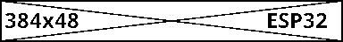
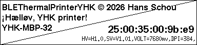

# BLEThermalPrinterYHK

Arduino library for YHK-compatible graphics-only thermal printers over BLE
(NimBLE), with an optional u8g2 canvas so you can draw with u8g2's normal
API and print the result directly.

Built from two working sketches:
- scanning + service/characteristic discovery (status/serial/product name queries)
- ESC/POS raster graphics printing

Same BLE service family as [tiny_print_library](https://github.com/ramo828/tiny_print_library/).

## Install

1. In Arduino IDE: `Sketch -> Show Sketch Folder`, go up one level into
   `Arduino/`, then into `libraries/`.
2. Copy this whole `BLEThermalPrinterYHK` folder in there, so you end up with:
   `Arduino/libraries/BLEThermalPrinterYHK/{library.properties, src/, examples/}`.
3. Restart the Arduino IDE (or `Sketch -> Include Library -> Refresh`,
   depending on IDE version).
4. Install the **NimBLE-Arduino** library via Library Manager (this is
   the only hard dependency). Install **U8g2** too if you want to use
   `printCanvas()`.
5. Open `File -> Examples -> BLEThermalPrinterYHK -> PrintCanvas` (or
   `PrintBitmap`) to try it.

## Examples

### [PrintBitmap](examples/PrintBitmap/PrintBitmap.ino)

This is the simplest example as this printer can only print graphics.



### [PrintText](examples/PrintText/PrintText.ino)

Require some fonts and preferrable with UTF-8.
Here [U8g2](https://github.com/olikraus/u8g2/) is used to draw
the text in a buffer (canvas) and then print it.



## API

```cpp
BLEThermalPrinterYHK printer;

printer.begin();               // scan + connect to first known printer
printer.isConnected();
printer.printCanvas(u8g2);     // send whatever's in a full-buffer u8g2 canvas
printer.printBitmap(buf, w, h);// send a raw 1bpp MSB-first row-major bitmap
printer.feed(3);
printer.queryStatus(reply);
printer.querySerialNumber(reply);
printer.queryProductName(reply);
printer.end();
```

## Notes / current limitations (prototype status)

- `printCanvas()` requires a **full-buffer** u8g2 constructor (name
  contains `_F_`). Paged constructors don't keep the whole image in RAM.
- Only the first printer seen advertising a known service UUID is used;
  no multi-device support yet.
- `begin()`/print calls block (using `delay()` loops) rather than being
  async -- fine for a "wake up, print one thing" flow, less fine if you
  need to keep doing other work while printing.
- BLE notification subscription uses a static function-pointer callback,
  so only one `BLEThermalPrinterYHK` instance can usefully receive notifications
  at a time (a limitation of NimBLE's `subscribe()` API, not this
  library specifically).
- Row-height in the raster header is hardcoded to 1 (matches the
  reference demo); sending taller chunks per header would be a
  straightforward speed optimization later.
- Bit order for raw raster data is **MSB-first** (bit 0x80 = leftmost
  pixel), same as standard PBM P4 / Epson ESC/POS raster -- confirmed
  by decoding a real test bitmap.pbm (frame + diagonal cross + text)
  both ways: MSB-first renders it correctly, LSB-first mirrors each
  8-pixel group and garbles the text.
